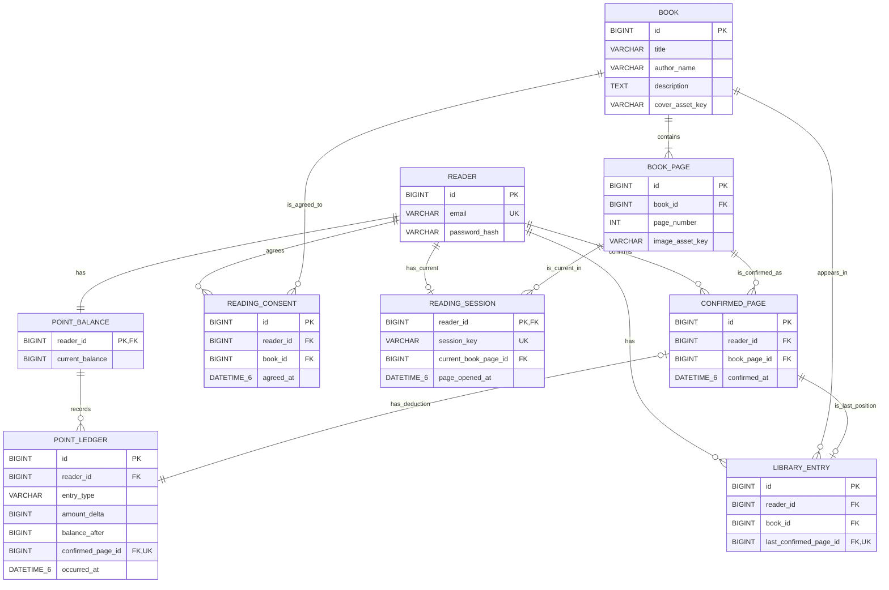

# 읽어볼까 ERD 초안

- 상태: 제안됨(구현 전 초안)
- 작성일: 2026-07-22
- 대상: 읽어볼까 MVP의 논리 모델과 MySQL 물리 모델 후보
- 기준 문서: [`CONTEXT.md`](./CONTEXT.md), [`docs/prd.md`](./docs/prd.md),
  [`docs/test-strategy.md`](./docs/test-strategy.md), [`docs/adr/`](./docs/adr/)

> 이 문서는 기존에 승인된 제품·도메인 계약을 데이터 구조로 옮긴 **초안**입니다.
> 아직 Entity나 Flyway migration을 만들기 위한 최종 스키마는 아닙니다.
> 아래의 "후속 결정 필요" 항목까지 합의한 뒤 데이터 모델 ADR을 승인하고 실제 스키마를 작성합니다.

## 1. 도메인 분석

### 1.1 핵심 흐름

1. 독자가 이메일과 비밀번호로 가입하면 포인트 잔액 행이 0P로 생성됩니다.
2. 독자는 도서 목록을 탐색하고 도서 상세 정보를 확인합니다.
3. 도서를 처음 읽기 전에 독자·도서 단위의 최초 열람 동의를 남깁니다.
4. 서버는 선택한 페이지가 이미 확정되었는지 확인하고, 미확정 페이지라면 잔액을 검사합니다.
   잔액이 부족하면 뷰어 진입과 이미지 제공을 차단합니다.
5. 진입할 수 있으면 독자별 현재 열람 세션을 새 식별자로 생성하거나 교체합니다.
   미확정 페이지는 열린 서버 시각을 함께 기록하고, 현재 페이지 이미지 하나만 제공합니다.
6. 서버 기준 6초가 지나면 포인트 차감, 차감 내역, 열람 확정, 서재 진도를 한 트랜잭션으로 반영합니다.
7. 이미 확정된 페이지는 포인트를 다시 차감하지 않고 재열람합니다.

### 1.2 도메인 경계

| 도메인 | 엔터티 | 책임 |
| --- | --- | --- |
| 계정 | `Reader` | 이메일·비밀번호 기반 독자 식별 |
| 도서 | `Book`, `BookPage` | 도서 메타데이터와 페이지별 이미지 식별 |
| 열람 | `ReadingConsent`, `ReadingSession`, `ConfirmedPage` | 최초 동의, 현재 뷰어 상태, 열람 확정 기록 |
| 포인트 | `PointBalance`, `PointLedger` | 현재 포인트 잔액과 변경 불가능한 지급·차감 내역 |
| 서재 | `LibraryEntry` | 한 페이지 이상 확정된 도서와 마지막 확정 위치 |

`ReadingConsent`와 `LibraryEntry`는 합치지 않습니다.
동의했지만 아직 한 페이지도 열람 확정하지 않은 도서는 내 서재에 나타나면 안 되므로 두 상태의 생성 시점과 의미가 다릅니다.

`PointBalance`는 `Reader`와 분리합니다.
포인트를 별도 도메인으로 유지하면서 동시 차감 때 잠글 잔액 행을 명확히 만들기 위해서입니다.

### 1.3 모델링 원칙

- 같은 도서의 페이지는 `BookPage`의 `(book_id, page_number)`로 식별합니다.
- 독자·도서·페이지별 최초 1회 규칙은 `ConfirmedPage`의 `(reader_id, book_page_id)` 고유 제약으로 보장합니다.
  `book_page_id`가 도서와 페이지 번호를 이미 포함하므로 `book_id`와 `page_number`를 다시 저장하지 않습니다.
- 포인트 원장은 증감을 부호 있는 값으로 기록합니다. 테스트 지급은 양수, 페이지 차감은 `-50`입니다.
- `PointBalance.current_balance`는 빠른 잔액 확인과 동시성 제어를 위한 현재값이고,
  `PointLedger` 합계가 회계상 근거입니다. 두 값은 항상 같아야 합니다.
- `ReadingSession`은 종료 이력을 쌓지 않고 독자별 현재 상태 한 행만 유지합니다.
  새 뷰어가 열리면 같은 행의 식별자를 교체해 이전 뷰어 요청을 무효화합니다.
- 이미지 저장소는 아직 미정이므로 공개 URL 대신 저장소 독립적인 `asset_key`만 저장합니다.
- 전역 페이지 단가 50P와 열람 확정 기준 6초는 가격·설정 테이블을 만들지 않고 도메인 상수로 둡니다.

## 2. ERD



관계 기호는 `||`가 정확히 1개, `o|`가 0개 또는 1개, `o{`가 0개 이상, `|{`가 1개 이상을 뜻합니다.
예를 들어 `READER ||--o| READING_SESSION`은 독자 한 명에게 현재 열람 세션이 없거나 하나만 있다는 뜻입니다.

## 3. 엔터티 상세

아래 타입과 길이는 MySQL 8.x 기준 후보입니다. PK 생성 방식과 문자열 길이는 구현 전에 확정합니다.
모든 시각은 UTC로 저장하며, `DATETIME(6)`은 6초 경계 검증에 필요한 마이크로초 정밀도를 제공합니다.

### 3.1 `reader` — 독자

| 컬럼 | 타입 후보 | 제약 | 설명 |
| --- | --- | --- | --- |
| `id` | `BIGINT` | PK, NOT NULL | 독자 식별자 |
| `email` | `VARCHAR(320)` | NOT NULL, UNIQUE | 회원가입과 로그인에 사용하는 이메일 |
| `password_hash` | `VARCHAR(255)` | NOT NULL | 원문 비밀번호가 아닌 단방향 해시 |

이름, 역할, 탈퇴 시각, 소셜 계정 컬럼은 현재 요구사항에 없으므로 두지 않습니다.
관리자 기능과 회원 탈퇴도 MVP 제외 범위입니다.

### 3.2 `point_balance` — 포인트 잔액

| 컬럼 | 타입 후보 | 제약 | 설명 |
| --- | --- | --- | --- |
| `reader_id` | `BIGINT` | PK, FK, NOT NULL | `reader.id`; 독자와 포인트 잔액의 1:1 관계 |
| `current_balance` | `BIGINT` | NOT NULL, DEFAULT 0, CHECK >= 0 | 현재 사용할 수 있는 포인트 |

회원가입 시 독자 행과 0P 포인트 잔액 행을 함께 생성합니다.
`reader_id` 자체가 PK이므로 한 독자에게 포인트 잔액 행이 두 개 생길 수 없습니다.

### 3.3 `point_ledger` — 포인트 원장

| 컬럼 | 타입 후보 | 제약 | 설명 |
| --- | --- | --- | --- |
| `id` | `BIGINT` | PK, NOT NULL | 원장 식별자 |
| `reader_id` | `BIGINT` | FK, NOT NULL | `point_balance.reader_id` |
| `entry_type` | `VARCHAR(30)` | NOT NULL | `TEST_GRANT` 또는 `PAGE_DEDUCTION` |
| `amount_delta` | `BIGINT` | NOT NULL | 지급은 양수, 페이지 차감은 `-50` |
| `balance_after` | `BIGINT` | NOT NULL, CHECK >= 0 | 이 내역 반영 직후 잔액 |
| `confirmed_page_id` | `BIGINT` | FK, NULL, UNIQUE | 지급은 NULL, 페이지 차감은 해당 `confirmed_page.id` |
| `occurred_at` | `DATETIME(6)` | NOT NULL | 지급 또는 차감 시각(UTC) |

`updated_at`과 삭제 표시 컬럼은 두지 않습니다.
생성된 원장은 수정하거나 삭제하지 않는 것이 도메인 계약이기 때문입니다.
`confirmed_page_id`의 UNIQUE는 하나의 열람 확정에 차감 원장이 여러 개 연결되는 것을 막습니다.
MySQL의 UNIQUE 컬럼은 NULL을 여러 개 허용하므로 테스트 지급 내역끼리는 충돌하지 않습니다.
페이지 차감 상세의 도서 제목과 페이지 번호는 `point_ledger → confirmed_page → book_page → book` 순서로 조회하며,
도서 수정·삭제가 없는 MVP에서는 별도 제목 스냅샷을 중복 저장하지 않습니다.

### 3.4 `book` — 도서

| 컬럼 | 타입 후보 | 제약 | 설명 |
| --- | --- | --- | --- |
| `id` | `BIGINT` | PK, NOT NULL | 도서 식별자 |
| `title` | `VARCHAR(255)` | NOT NULL | 제목과 가나다순 목록 기준 |
| `author_name` | `VARCHAR(255)` | NOT NULL | 저자 검색 대상 문자열 |
| `description` | `TEXT` | NOT NULL | 짧은 소개 |
| `cover_asset_key` | `VARCHAR(512)` | NOT NULL | 저장소 독립적인 표지 이미지 식별자 |

저자 상세나 다중 저자 요구가 없으므로 `Author` 테이블을 만들지 않습니다.
`title`도 가상 도서 사이에서 중복될 수 있어 고유 제약을 두지 않습니다.

전체 페이지 수는 `book_page` 행 개수로 계산하는 안을 우선 제안합니다.
`book.total_page_count`를 따로 저장하면 페이지 행 개수와 맞지 않을 수 있고,
두 값을 일치시키는 일반 CHECK 제약을 만들 수 없기 때문입니다.

### 3.5 `book_page` — 도서 페이지

| 컬럼 | 타입 후보 | 제약 | 설명 |
| --- | --- | --- | --- |
| `id` | `BIGINT` | PK, NOT NULL | 전역 페이지 식별자 |
| `book_id` | `BIGINT` | FK, NOT NULL | `book.id` |
| `page_number` | `INT` | NOT NULL, CHECK > 0 | 도서 안에서 1부터 시작하는 페이지 번호 |
| `image_asset_key` | `VARCHAR(512)` | NOT NULL | 페이지 이미지의 저장소 독립적 식별자 |

`UNIQUE (book_id, page_number)`로 같은 도서에 같은 페이지 번호가 두 번 생기는 것을 막습니다.
원본 PDF 공개 URL은 저장하지 않으며, 뷰어 API는 이 테이블의 현재 페이지 이미지 하나만 제공합니다.

### 3.6 `reading_consent` — 최초 열람 동의

| 컬럼 | 타입 후보 | 제약 | 설명 |
| --- | --- | --- | --- |
| `id` | `BIGINT` | PK, NOT NULL | 동의 식별자 |
| `reader_id` | `BIGINT` | FK, NOT NULL | `reader.id` |
| `book_id` | `BIGINT` | FK, NOT NULL | `book.id` |
| `agreed_at` | `DATETIME(6)` | NOT NULL | 동의 시각(UTC) |

`UNIQUE (reader_id, book_id)`로 한 독자에게 같은 도서의 동의를 반복해서 받지 않습니다.
최소 모델에서는 동의한 사실만 저장하고, 거부는 행으로 남기지 않습니다.
가격 정책 버전과 동의 문구 버전은 현재 요구사항에 없으므로 저장하지 않습니다.

### 3.7 `reading_session` — 현재 열람 세션

| 컬럼 | 타입 후보 | 제약 | 설명 |
| --- | --- | --- | --- |
| `reader_id` | `BIGINT` | PK, FK, NOT NULL | `reader.id`; 독자별 현재 세션 최대 1개 보장 |
| `session_key` | `VARCHAR(128)` | NOT NULL, UNIQUE | 로그인 세션과 구분되는 예측 불가능한 뷰어 식별자 |
| `current_book_page_id` | `BIGINT` | FK, NOT NULL | 현재 뷰어에 열린 `book_page.id` |
| `page_opened_at` | `DATETIME(6)` | NULL | 미확정 페이지를 연 서버 시각; 확정 페이지 재열람이면 NULL 가능 |

새 뷰어가 열리면 같은 `reader_id` 행의 `session_key`를 교체합니다.
이전 뷰어가 늦게 확정 요청을 보내도 키가 일치하지 않아 거절됩니다.
뷰어 종료 시 행을 삭제하며, 종료된 세션 이력은 MVP에서 보존하지 않습니다.

미확정 페이지로 이동할 때마다 `current_book_page_id`와 `page_opened_at`을 함께 새 값으로 바꿉니다.
페이지 이동과 이미지 제공 전에는 대상 `BookPage`가 현재 뷰어와 같은 도서에 속하고
해당 `ReadingConsent`가 있는지 매번 확인합니다. 다른 도서로 이동하려면 새 뷰어 세션을 열어야 합니다.
확정 요청은 요청에 포함된 페이지, 현재 세션의 페이지, 서버가 기록한 열린 시각을 모두 대조해야 합니다.

### 3.8 `confirmed_page` — 열람 확정 페이지

| 컬럼 | 타입 후보 | 제약 | 설명 |
| --- | --- | --- | --- |
| `id` | `BIGINT` | PK, NOT NULL | 열람 확정 식별자 |
| `reader_id` | `BIGINT` | FK, NOT NULL | `reader.id` |
| `book_page_id` | `BIGINT` | FK, NOT NULL | 확정된 `book_page.id` |
| `confirmed_at` | `DATETIME(6)` | NOT NULL | 최초 열람 확정 시각(UTC) |

`UNIQUE (reader_id, book_page_id)`가 중복 차감을 막는 최종 DB 안전장치입니다.
재열람에서는 이 행을 추가하지 않고 기존 행을 조회합니다. 열람 확정 기록도 수정하거나 삭제하지 않습니다.

### 3.9 `library_entry` — 내 서재 항목과 이어 읽기 위치

| 컬럼 | 타입 후보 | 제약 | 설명 |
| --- | --- | --- | --- |
| `id` | `BIGINT` | PK, NOT NULL | 서재 진도 식별자 |
| `reader_id` | `BIGINT` | FK, NOT NULL | `reader.id` |
| `book_id` | `BIGINT` | FK, NOT NULL | `book.id` |
| `last_confirmed_page_id` | `BIGINT` | FK, NOT NULL, UNIQUE | 가장 최근에 성공한 `confirmed_page.id` |

`UNIQUE (reader_id, book_id)`로 한 독자의 같은 도서가 내 서재에 한 번만 나타나게 합니다.
첫 열람 확정 때 생성하고, 이후 다른 페이지가 성공적으로 열람 확정될 때 `last_confirmed_page_id`만 갱신합니다.
누적 사용 포인트와 별도 서재 담기 상태는 저장하지 않습니다.

## 4. 핵심 제약조건

### 4.1 DB가 직접 보장할 제약

```text
reader:
  UNIQUE(email)

book_page:
  UNIQUE(book_id, page_number)
  CHECK(page_number > 0)

reading_consent:
  UNIQUE(reader_id, book_id)

confirmed_page:
  UNIQUE(reader_id, book_page_id)

point_balance:
  CHECK(current_balance >= 0)

point_ledger:
  UNIQUE(confirmed_page_id)
  CHECK(balance_after >= 0)
  CHECK(
      (entry_type = 'TEST_GRANT'
          AND amount_delta > 0
          AND confirmed_page_id IS NULL)
      OR
      (entry_type = 'PAGE_DEDUCTION'
          AND amount_delta = -50
          AND confirmed_page_id IS NOT NULL)
  )

library_entry:
  UNIQUE(reader_id, book_id)
  UNIQUE(last_confirmed_page_id)
```

모든 FK의 삭제 정책은 우선 `RESTRICT`로 제안합니다.
회원·도서 삭제가 MVP 범위에 없고, 원장과 열람 확정 이력에 `CASCADE DELETE`를 사용하면
변경 불가능한 기록이 함께 사라질 수 있기 때문입니다.

### 4.2 한 행의 제약만으로는 보장할 수 없는 규칙

다음 규칙은 여러 테이블이나 여러 행을 함께 비교하므로 일반적인 FK와 CHECK만으로 완전히 보장할 수 없습니다.

| 규칙 | 보장 방법 |
| --- | --- |
| `current_balance = COALESCE(SUM(amount_delta), 0)` | 포인트 잔액 행 잠금, 잔액 변경과 원장 생성을 한 트랜잭션으로 처리, 통합 테스트에서 합계 대조 |
| 열람 확정 1개 = 페이지 차감 원장 정확히 1개 | `confirmed_page_id` UNIQUE로 최대 1개 보장 + 두 행을 같은 트랜잭션에서 생성 |
| 차감 원장과 열람 확정의 독자가 같음 | 같은 유스케이스에서 인증된 `reader_id`만 사용; 실제 migration에서 복합 FK 적용 여부 검토 |
| 서재의 마지막 확정 페이지가 같은 독자·도서에 속함 | 같은 트랜잭션에서 확인 후 갱신; 실제 migration에서 복합 FK 적용 여부 검토 |
| 현재 세션 페이지의 도서에 독자가 동의함 | 뷰어 시작과 모든 페이지 이동·이미지 제공 전에 대상 도서의 `reading_consent`를 확인 |
| 각 도서의 페이지 번호가 1부터 끊김없이 이어짐 | 더미 도서 적재 과정에서 페이지 이미지 개수와 번호 연속성을 검증 |
| 원장 수정·삭제 금지 | 애플리케이션에 수정·삭제 경로를 만들지 않고 운영 DB 권한 또는 트리거 적용 여부를 후속 결정 |

## 5. 열람 확정 트랜잭션

**미확정 페이지** 진입 시 잔액 검사는 페이지 이미지를 보여줘도 되는지 판단하는 사전 검사일 뿐, 50P를 예약하지 않습니다.
6초 동안 다른 요청이 포인트를 사용할 수 있으므로 확정 시점에 다시 검사해야 합니다.
기존 `confirmed_page`가 있는 재열람은 잔액을 검사하지 않고 페이지 이미지를 제공합니다.

1. `reading_session` 행을 잠급니다.
2. 세션 키와 현재 페이지가 요청과 일치하는지 검증합니다.
3. 이미 `confirmed_page`가 있으면 6초와 잔액을 다시 검사하지 않고 재시도 성공으로 처리합니다.
4. 미확정 페이지라면 `page_opened_at`이 있고 서버 기준 6초가 지났는지 검증합니다.
5. `point_balance` 행을 잠그고, 확정 기록을 다시 확인한 뒤 잔액이 50P 이상인지 검사합니다.
6. `confirmed_page`를 생성합니다.
7. `point_balance.current_balance`에서 50P를 차감합니다.
8. `point_ledger`에 `PAGE_DEDUCTION`, `-50`, 차감 후 잔액, 확정 ID를 기록합니다.
9. `library_entry`를 생성하거나 마지막 확정 위치로 갱신합니다.
10. `reading_session.page_opened_at`을 비워 현재 페이지가 이미 확정되었음을 표시합니다.
11. 모두 성공한 경우에만 커밋합니다. 하나라도 실패하면 전부 롤백합니다.

모든 열람 변경 작업이 `reading_session` 다음 `point_balance` 순서로 행을 잠그면,
페이지 이동과 확정 요청이 겹치거나 여러 차감 요청이 동시에 들어올 때 처리 순서가 분명해지고 교착 가능성도 줄어듭니다.
고유 제약 위반은 마지막 안전장치이며, 예외가 발생한 트랜잭션은 롤백한 뒤 기존 확정 결과를 다시 조회해야 합니다.

테스트 포인트 지급도 `point_balance` 잠금, 잔액 증가, `TEST_GRANT` 원장 생성을 한 트랜잭션으로 처리합니다.

## 6. 불변식과 설계의 연결

| 불변식·요구사항 | ERD에서의 표현 | 추가 검증 |
| --- | --- | --- |
| INV-001 포인트 보존 | `PointBalance` + 부호 있는 `PointLedger.amount_delta` | 매 처리 후 잔액과 원장 합계 대조 |
| INV-002 중복 차감 금지 | `ConfirmedPage UNIQUE(reader_id, book_page_id)` + 원장 확정 ID UNIQUE | 동시 요청·10회 재시도 통합 테스트 |
| INV-003 원자성 | 확정 ID로 차감 원장 연결, 서재는 확정 행 참조 | 네 변경을 한 트랜잭션으로 처리하고 실패 주입 |
| INV-004 음수 잔액 금지 | `PointBalance CHECK(current_balance >= 0)` | 잔액 행 잠금과 0P·49P·50P 경계 테스트 |
| INV-005 변경 불가능한 내역 | 원장에 수정용 컬럼 없음, FK 삭제 `RESTRICT` | UPDATE·DELETE 경로 부재와 운영 권한 검토 |
| 서버 기준 6초 | `ReadingSession.page_opened_at` | 5.999초 거절, 6.000초 승인 테스트 |
| 독자별 세션 최대 1개 | `ReadingSession.reader_id`가 PK | 새 세션이 이전 키를 무효화하는 테스트 |
| 독자·도서별 최초 동의 | `ReadingConsent UNIQUE(reader_id, book_id)` | 재진입 시 동의 화면 생략 테스트 |
| 내 서재와 이어 읽기 | `LibraryEntry UNIQUE(reader_id, book_id)` + 마지막 확정 FK | 실패 시 진도 미변경, 성공 시 마지막 위치 갱신 테스트 |

## 7. 조회용 인덱스 초안

고유 제약과 FK 인덱스 외에 현재 요구사항에서 바로 필요한 인덱스만 제안합니다.

| 인덱스 | 목적 |
| --- | --- |
| `book (title, id)` | 제목 가나다순 목록과 같은 제목의 안정적인 순서 |
| `point_ledger (reader_id, occurred_at DESC, id DESC)` | 독자 자신의 최신 포인트 내역 페이지네이션 |

제목 또는 저자 **부분 일치**가 `%검색어%` 방식이면 일반 B-tree 인덱스를 충분히 활용하기 어렵습니다.
MVP는 100권이므로 먼저 단순 조회로 검증하고, 실제 데이터가 커질 때 검색 전략을 별도 결정합니다.

## 8. MVP ERD에서 제외한 대상

- 결제, 주문, 실제 포인트 충전, 환불
- 관리자와 도서 운영 백오피스
- 책별 가격, 페이지별 가격, 전체 책 가격
- 리뷰, 평점, 추천, 판매량, 장르
- 목차, 책갈피, 메모, 하이라이트
- 회원 탈퇴, 소셜 로그인, 비밀번호 찾기
- 원본 PDF 공개 경로, 다운로드·인쇄 기록, DRM
- 종료된 열람 세션 이력

## 9. 후속 결정 필요

다음 항목은 기존 문서에서 아직 확정되지 않았으므로 이 초안에서 임의로 결정하지 않습니다.

1. PK를 `BIGINT AUTO_INCREMENT`로 할지 UUID로 할지
2. 이메일 정규화와 대소문자 비교 방식
3. 페이지 이미지 저장소와 `asset_key` 형식
4. 인증과 로그인 세션 구현 방식
5. 한글 제목의 정확한 가나다순 MySQL collation
6. 원장 UPDATE·DELETE 차단을 애플리케이션 규칙, DB 권한, 트리거 중 어디까지 적용할지
7. `ReadingSession`, `PointLedger`, `LibraryEntry`에 복합 FK를 적용해 같은 독자·도서 연결을 DB에서 강제할지
8. 이미 확정된 페이지를 재열람했을 때도 서재의 마지막 위치를 갱신할지
9. 전체 페이지 수를 `COUNT(book_page)`로 계산할지 `book.total_page_count`로 저장할지

8번은 제품 의미에 영향을 줍니다.
현재 문서는 **새 페이지의 최초 열람 확정** 때 마지막 위치를 갱신하는 흐름만 확정하고,
이미 확정된 페이지의 재열람이 마지막 위치를 바꾸는지는 명시하지 않습니다.
