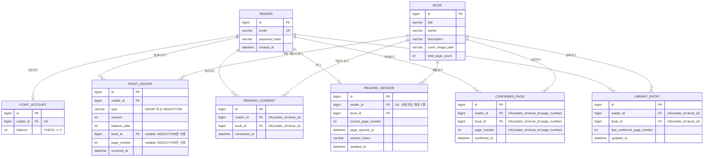

# 0007. 핵심 도메인 엔티티와 ERD를 정의한다

- 상태: 제안됨
- 날짜: 2026-07-22
- 결정자: AI 초안 — 검토 대기

## 맥락

읽어볼까 백엔드는 제품·도메인 계약(CONTEXT.md, docs/prd.md, docs/test-strategy.md)과 되돌리기 비싼
기술 결정(ADR-0001~0006)이 이미 합의된 상태이지만, 아직 JPA Entity나 Flyway migration은 만들지
않은 골격 단계입니다(`src`에는 `IlgeobolkkaApplication`만 존재). 데이터 모델은 한 번 스키마로
굳으면 마이그레이션 비용이 크므로, 실제 Entity 코드를 작성하기 전에 엔티티·관계·제약을 ERD로
먼저 정리해 검토받습니다.

아래 표는 PRD 7절 기능 요구사항과 test-strategy.md 4절 핵심 불변식을 이 ADR이 정의하는 엔티티에
매핑한 것입니다. 모든 요구사항 ID와 불변식이 최소 한 엔티티에 근거를 두고 있습니다.

| 요구사항/불변식 | 관련 엔티티 | 근거 |
| --- | --- | --- |
| AUTH-001, AUTH-002 | `Reader`, `PointAccount` | prd.md 6.1, 7 |
| CAT-001~003 | `Book` | prd.md 6.2, 7 |
| CNS-001 | `ReadingConsent` | prd.md 6.3, 7 |
| VIEW-001, VIEW-002 | `ReadingSession` | prd.md 6.4, 7 |
| BILL-001~006 | `ReadingSession`, `ConfirmedPage`, `PointAccount`, `PointLedger` | prd.md 5.2, 5.3, 6.4, 7 |
| LIB-001 | `LibraryEntry` | prd.md 6.5, 7 |
| PTS-001, PTS-002 | `PointAccount`, `PointLedger` | prd.md 6.6, 7 |
| INV-001 포인트 보존 | `PointAccount.balance`, `PointLedger` 합계 | test-strategy.md 4 |
| INV-002 중복 차감 금지 | `ConfirmedPage`의 `(reader_id, book_id, page_number)` 유니크 제약 | test-strategy.md 4 |
| INV-003 차감·확정의 원자성 | `PointAccount`, `PointLedger`, `ConfirmedPage`, `LibraryEntry`를 하나의 트랜잭션에서 갱신 | test-strategy.md 4, conventions.md Facade/트랜잭션 절 |
| INV-004 음수 잔액 금지 | `PointAccount.balance`에 대한 행 잠금과 0 이상 제약 | test-strategy.md 4 |
| INV-005 내역 불변 | `PointLedger` — 수정·삭제 메서드를 두지 않음 | test-strategy.md 4 |

## 고려한 대안

- **포인트 잔액 저장 위치 — `PointAccount`에 잔액 컬럼을 두고 잠금으로 보호 vs `PointLedger` 합계를
  매번 계산**: 매번 `SUM()`으로 계산하면 별도 상태 컬럼이 없어 단순해 보이지만, InnoDB에서 집계
  쿼리에 대한 잠금은 새로 삽입되는 행까지 막아주지 않아 동시 요청에서 INV-004(음수 잔액 금지)를
  안정적으로 보장하기 어렵습니다. 또한 INV-003이 "차감"과 "내역 생성"을 서로 다른 단계로 명시하고
  있어(test-strategy.md 4), 잔액을 별도 컬럼으로 두는 편이 계약과도 일치합니다. `PointAccount` 행에
  `SELECT ... FOR UPDATE`로 잠근 뒤 잔액을 갱신하고 같은 트랜잭션에서 `PointLedger`를 추가하는
  방식을 선택했습니다. (관련: ADR-0003, INV-001, INV-003)
- **페이지 자산 관리 — 페이지마다 `Page` 엔티티를 두는 방식 vs 도서·페이지 번호로부터 정적 경로를
  계산하는 방식**: ADR-0002는 PDF를 사전에 페이지별 이미지로 변환해 둔다고 이미 결정했습니다.
  페이지 이미지 경로가 `bookId`와 `pageNumber`로부터 결정적으로 계산 가능하고, 페이지 자체가
  이미지 경로 외에 별도로 저장할 속성이 없다면 행마다 엔티티를 두는 것은 AGENTS.md 3절(단순함
  우선, "지워도 요청 기능이 동작하면 지운다")에 어긋납니다. `Book.totalPageCount`로 유효 페이지
  번호 범위를 검증하고, 페이지 이미지 경로는 정적 규칙(예: `{bookId}/{pageNumber}.jpg`)으로
  계산하는 방식을 선택했습니다. 페이지 자체를 나타내는 엔티티는 두지 않습니다.
- **열람 세션 이력 관리 — 세션마다 새 행과 `ReadingSessionStatus`(ACTIVE/REPLACED)를 남기는 방식 vs
  사용자당 한 행을 유지하며 덮어쓰는 방식**: VIEW-002는 "사용자당 하나의 온라인 열람 세션만 허용"만
  요구하고, 지나간 세션의 조회 이력까지 요구하지 않습니다. 상태 이력을 남기면 이전 세션의 지연
  요청(T-BILL-008)을 판별할 수 있다는 장점이 있지만, `reader_id` 유니크 제약을 둔 단일 행을 새
  `session_token`으로 덮어써도 이전 토큰을 가진 요청은 더 이상 일치하지 않아 같은 효과를 더 단순한
  구조로 얻을 수 있습니다. 사용자당 한 행을 유지하는 방식을 선택했습니다. 같은 사용자의 세션 오픈
  요청 두 개가 거의 동시에 도착해도 `reader_id`로 행을 조회해 있으면 갱신하고 없으면 삽입하되, 최초
  삽입 경합으로 유니크 제약 위반이 발생하면 이미 삽입된 행을 다시 조회해 갱신하는 방식으로 처리할 수
  있어 MVP 범위에서 실현 가능합니다. 동시 접속량이 낮은 MVP 규모에서 이 정도 경합은 증거 없이 별도
  분산 락 없이 다룰 수 있습니다(conventions.md 주석과 과한 설계 제한 절).

## 결정

아래 Mermaid `erDiagram`으로 핵심 도메인 엔티티와 관계를 정의합니다.

엔티티별 핵심 필드와 제약은 다음과 같습니다.

- **`Reader`**: 이메일·비밀번호 로그인 계정(AUTH-001, AUTH-002). `email`은 유니크. 페이지·엔티티
  전용이 아닌 인증 도메인 소속으로 볼 수 있으나, 최종 패키지 배치는 이 ADR의 범위가 아닙니다.
- **`Book`**: 도서 메타데이터(CAT-001~003). `totalPageCount`는 상세 화면 표시와 페이지 번호 유효성
  검증에 사용합니다. 페이지 단가·전체 책 가격 컬럼은 두지 않습니다(ADR-0003, PRD 5.1).
- **`ReadingConsent`**: 최초 열람 동의(CNS-001). `(reader_id, book_id)` 유니크 제약으로 "사용자·도서별
  최초 한 번만" 동의를 보장합니다.
- **`ReadingSession`**: 사용자당 하나의 온라인 열람 세션(VIEW-002)과 열람 확정 6초 판정의 기준
  시각(`page_opened_at`, BILL-001)을 관리합니다. `reader_id` 유니크 제약으로 세션이 한 행만
  존재하게 하고, 새 뷰어가 열리면 같은 행을 새 `session_token`과 값으로 덮어써 이전 세션의 지연
  요청을 자연스럽게 무효화합니다. 같은 세션 안에서 현재 페이지와 동일한 `pageNumber`로 페이지 이동
  요청이 다시 들어오면 페이지 이동으로 보지 않고 `page_opened_at`을 갱신하지 않습니다(ADR-0001의
  6초 판정, ADR-0008 참고).
- **`ConfirmedPage`**: 열람 확정 페이지(BILL-002). `(reader_id, book_id, page_number)` 유니크
  제약이 INV-002(중복 차감 금지)를 DB 수준에서 보장합니다. 별도의 `Page` 엔티티 없이 `book_id`와
  `page_number`로 페이지를 식별합니다. 확정 처리는 이 행의 존재 여부를 먼저 확인해 이미 확정된
  페이지라면 `PointAccount`를 잠그지 않고 차감 없이 응답하며, 동시 확정 경합으로 유니크 제약을
  위반하면 이미 다른 요청이 확정한 것으로 간주합니다(순서와 응답 값은 ADR-0008 참고).
- **`LibraryEntry`**: 내 서재 항목(LIB-001). `(reader_id, book_id)` 유니크 제약, 마지막 열람 확정
  페이지 번호를 갱신합니다. 누적 사용 포인트 컬럼은 두지 않습니다(PRD 6.5).
- **`PointAccount`**: 독자별 현재 포인트 잔액(PTS-001, INV-001, INV-004). `reader_id` 유니크
  제약으로 독자당 한 행만 존재합니다. 차감 시 이 행을 잠그고(`SELECT ... FOR UPDATE`) 잔액을
  갱신한 뒤 같은 트랜잭션에서 `PointLedger`를 추가합니다. 이 잠금은 `ConfirmedPage`가 아직 없을
  때만 획득하며, 이미 확정된 페이지의 재확인 요청에서는 잠그지 않습니다.
- **`PointLedger`**: 포인트 지급·차감 내역(PTS-001, PTS-002, INV-005). `type`으로 지급/차감을
  구분하고, `balance_after`를 저장해 "차감 후 잔액" 조회(T-PTS-001)를 별도 계산 없이 제공합니다.
  차감 항목만 `book_id`, `page_number`를 채웁니다. 생성 후 수정·삭제하는 메서드를 두지 않습니다.

포인트 차감, 내역 생성, 열람 확정 기록, 마지막 열람 위치 갱신(`PointAccount`, `PointLedger`,
`ConfirmedPage`, `LibraryEntry` 갱신)은 INV-003에 따라 하나의 트랜잭션에서 처리합니다.

## 결과

- 이후 JPA Entity와 Flyway migration을 작성할 때 이 ERD를 1차 기준으로 삼습니다. 유니크 제약
  (`ReadingConsent`, `ConfirmedPage`, `LibraryEntry`, `PointAccount`, `ReadingSession`의 `reader_id`
  유니크)은 애플리케이션 검사뿐 아니라 MySQL 고유 제약으로도 구현합니다(conventions.md
  Repository와 스키마 절).
- 별도 `Page` 엔티티가 없으므로 페이지 이미지 파일의 실제 저장 위치·명명 규칙은 이후 `infra` 계층
  설계에서 구체화가 필요합니다(현재는 정적 경로 계산 방식만 결정).
- `ReadingSession`을 한 행으로 유지하는 결정은 세션 이력 조회나 감사 로그가 필요해지면 재검토가
  필요합니다. 필요해지면 새 ADR로 전환 여부를 결정합니다(AGENTS.md 2절, conventions.md 주석과 과한
  설계 제한 절).
- 비밀번호 해시 알고리즘, 각 엔티티의 정확한 패키지 소속(`reader`/`auth` 등), Flyway 마이그레이션
  파일 자체는 이 ADR의 범위가 아니며 후속 구현 작업에서 결정합니다.
- 비즈니스 로직·예외 케이스·실현 가능성 관점 팀 검토(SCRUM-86) 완료, 발견 사항 반영. `PointAccount`
  잠금 순서, `ConfirmedPage` 유니크 제약 경합 처리, `ReadingSession` 동시 오픈 처리는 MVP 범위에서
  실현 가능하다고 판단했습니다(ADR-0008 "확정 요청 처리 순서" 절 참고).
- 이 ADR은 `제안됨` 상태의 초안입니다. 결정자 검토와 승인 후에만 `상태: 승인됨`으로 바꾸고, 그 전까지
  실제 Entity 구현의 확정 근거로 사용하지 않습니다.
