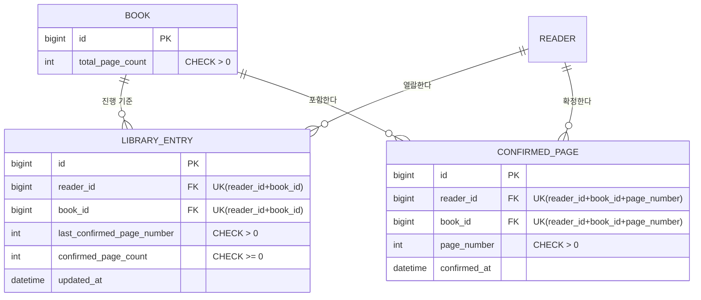

# 0018. 서로 다른 페이지의 90%를 열람 확정하면 소장으로 전환한다

- 상태: 승인됨
- 날짜: 2026-07-23

## 맥락

ADR-0017은 공개 도서 가격과 누적 사용 포인트로 소장을 판정했지만, MVP는 도서 가격이나 최대 총
차감액을 공개하지 않고 페이지별 고정 차감과 실제 열람 진도에 집중하기로 제품 정책을 변경했습니다.
중복·동시 요청에서도 확정 페이지 수와 실제 확정 행이 일치하고, 90% 경계의 차감과 소장 판정이 하나의
트랜잭션으로 처리되어야 합니다.

## 고려한 대안

- 공개 도서 가격에 누적 사용 포인트가 도달하면 소장 — 사용 상한은 명확하지만 도서 가격을 두지 않는 새 제품 정책과 충돌해 제외합니다.
- 모든 페이지를 열람 확정해야 소장 — 계산은 단순하지만 마지막 10%를 무료로 제공하는 정책을 충족하지 못해 제외합니다.
- 90% 진행률을 반올림하거나 버림 — 전체 페이지 수에 따라 90% 미만에서도 소장될 수 있어 제외합니다.
- 소장 여부와 전환 시각을 별도 필드로 저장 — 조회는 단순하지만 페이지 수에서 계산 가능한 상태가 중복되어 불일치할 수 있어 제외합니다.
- `ConfirmedPage`를 매번 집계 — 별도 상태는 없지만 동시 확정 요청에서 경계 판정과 화면 조회를 위한 집계 비용·잠금 계약이 복잡해 제외합니다.

## 결정

### 제품 정책

- 도서 가격, 원가, 최대 총 차감 포인트를 데이터·API·화면에 두지 않습니다.
- 소장 전 미확정 페이지의 실제 차감액은 항상 50P이며 부분 차감은 없습니다.
- 독자·도서별 소장 기준 페이지 수는 `ceil(totalPageCount × 0.9)`입니다.
- 부동소수점 계산을 사용하지 않고 정수식 `(totalPageCount * 9 + 9) / 10`으로 계산합니다.
- 서로 다른 페이지를 기준 수만큼 열람 확정하면 기준에 도달한 페이지까지 50P를 차감한 뒤 소장으로 판정합니다.
- 소장 후 아직 확정하지 않은 페이지는 잔액 검사와 차감 없이 열 수 있고 6초 확정과 마지막 위치 기록은 계속합니다.
- 향후 실제 충전은 1원 = 1P, 1,000원 단위 정책을 사용하지만 PG와 실제 충전은 MVP에서 제외합니다.

### 데이터 계약

- `Book`은 양수인 `total_page_count`만 가지며 가격 필드를 두지 않습니다.
- `LibraryEntry`에 `confirmed_page_count INT NOT NULL DEFAULT 0`을 추가합니다.
- `confirmed_page_count`는 같은 독자·도서의 `ConfirmedPage` 행 수와 같고 0 이상 `Book.total_page_count` 이하여야 합니다.
- 소장 여부는 `confirmedPageCount >= ownershipThresholdPageCount`로 계산하고 `owned_at` 또는 별도 boolean을 저장하지 않습니다.
- `PointLedger`의 DEDUCTION `amount`는 50P만 허용하고 `book_id`, `page_number`를 모두 기록합니다.
- 기존 V1은 수정하지 않고 후속 Flyway migration에서 카운트 backfill, 컬럼과 같은 행 안에서 검증 가능한 제약을 추가합니다.

### 차감·카운트·소장 판정 순서

차감이 필요한 요청은 ADR-0008의 세션 잠금과 6초 검증 원칙을 유지하면서 다음 순서로 처리합니다.

1. `ReadingSession`을 잠그고 세션 토큰·도서·현재 페이지와 6초 경과를 검증합니다.
2. 이미 존재하는 `ConfirmedPage`면 차감과 카운트 증가 없이 성공 응답을 반환합니다.
3. `PointAccount`를 잠그고 `ConfirmedPage`와 `LibraryEntry`를 다시 조회합니다.
4. 잠금 뒤 이미 확정된 페이지면 차감과 카운트 증가 없이 성공 응답을 반환합니다.
5. 현재 카운트가 소장 기준 이상이면 `ConfirmedPage`, `confirmedPageCount`, 마지막 위치만 갱신합니다.
6. 소장 전이면 잔액 50P 이상을 확인합니다.
7. 50P 차감, `PointLedger` 생성, `ConfirmedPage` 생성, 카운트 1 증가와 마지막 위치 갱신을 하나의 트랜잭션에서 처리합니다.
8. 증가한 카운트가 소장 기준에 도달했는지 같은 트랜잭션 안에서 판정합니다.

잠금 순서는 `ReadingSession` → `PointAccount` → `LibraryEntry`로 통일합니다. 같은 독자의 유효한 확정
요청을 직렬화하고, `ConfirmedPage`의 고유 제약을 최종 DB 안전망으로 유지합니다.

### 화면과 API 계약

- 공개 도서 목록·상세에는 가격 관련 필드가 없습니다.
- 공개 `GET /api/books/{bookId}`는 `readingProgress: null`을 반환합니다.
- 로그인한 독자의 상세와 서재에는 `confirmedPageCount`, `ownershipThresholdPageCount`, `owned`를 제공합니다.
- 아직 읽지 않은 로그인 독자는 카운트 0, 계산된 기준 페이지 수, `owned=false`를 받습니다.
- 최초 열람 동의에는 페이지당 50P, 재열람 무료, 90% 도달 시 소장과 이후 무료 열람을 알립니다.
- 6초 내부 판정과 계산된 최대 총 차감 포인트는 화면에 표시하지 않습니다.
- `ConfirmReadingResponse`는 `deductedAmount`, `balanceAfter`, `confirmedPageCount`, `ownershipThresholdPageCount`, `owned`를 포함합니다.
- 이미 확정된 페이지와 소장 후 페이지의 `deductedAmount`는 0입니다.
- 소장 전 미확정 페이지는 잔액이 50P 미만이면 422로 차단합니다.

### 요구사항 연결

| 요구사항 | 결정 근거 |
| --- | --- |
| BILL-002, BILL-005 | 소장 전 미확정 페이지 50P 고정 차감과 잔액 검사 |
| OWN-001 | 저장 카운트와 `ConfirmedPage` 행 수 일치 |
| OWN-002 | 90% 올림 기준과 계산된 소장 상태 |
| OWN-003 | 소장 후 추가 차감 금지와 진도 기록 유지 |
| LIB-001 | 서재의 확정·기준 페이지 수와 소장 상태 |
| PTS-001, PTS-002 | 50P 차감 원장과 잔액 일치 |

이 결정은 ADR-0017 전체와 ADR-0007의 `LibraryEntry` 카운트 미저장 결정, ADR-0008의 고정 50P 관련
API 계약을 현행 정책으로 대체합니다. 나머지 엔티티·세션 검증·오류 형식과 HTTP 상태 계약은 유지합니다.

## 결과

- 독자는 도서 가격 없이 페이지별 50P와 열람 비율만으로 소장 규칙을 이해할 수 있습니다.
- 가격·누적 사용액·소장 시각 상태가 사라져 데이터 모델과 응답이 단순해집니다.
- `confirmedPageCount`는 조회와 동시 경계 판정을 단순하게 하지만 실제 확정 행 수와의 일치 검증이 필요합니다.
- 총 페이지 수가 바뀌면 소장 기준도 바뀌므로 MVP에서는 도서 페이지 수 변경을 지원하지 않습니다.
- 가격 기반 소장, 할인, 환불이나 소장 전환 시각 표시를 도입하려면 새 ADR로 결정해야 합니다.
