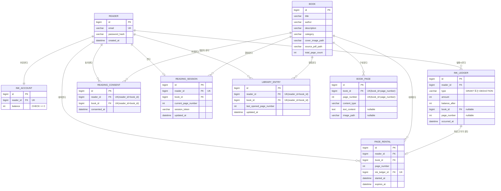

# 읽어볼까 목표 데이터 모델

## 문서 상태

- 상태: 새 잉크·30일 대여 정책 기준 목표 모델
- 기준일: 2026-07-25
- 구현 상태: 기존 V1 마이그레이션에는 아직 반영되지 않음

이 문서는 현재 적용할 데이터 모델의 정본입니다. 선택 근거는 [`ADR-0025`](../adr/active/data/0025-model-ink-rental-and-page-content.md)에 기록합니다.

## 핵심 제약

- `Book.totalPageCount`와 `BookPage`의 연속된 `1..N` 페이지 수가 일치해야 합니다.
- `BookPage.contentType`은 `TEXT`, `IMAGE`, `HYBRID` 중 하나이며 유형에 필요한 콘텐츠 필드를 채웁니다.
- `InkAccount.balance`는 0 이상이며 `InkLedger`의 지급·차감 합계와 일치해야 합니다.
- `InkLedger`는 생성 후 수정·삭제하지 않습니다.
- `PageRental`은 재대여 이력을 보존하기 위해 독자·도서·페이지별 여러 행을 허용합니다.
- 각 `PageRental`은 정확히 하나의 잉크 차감 내역을 가리키고 `expiresAt = startedAt + 30일`을 만족해야 합니다.
- 동시 요청에서는 계정 잠금 뒤 해당 페이지의 최신 대여를 다시 조회하여 아직 유효하면 새 대여와 차감 내역을 만들지 않습니다.
- 책별 가격, 사용하지 않은 잉크 유효기간과 잉크 묶음별 만료 필드는 정책 확정 전까지 추가하지 않습니다.
