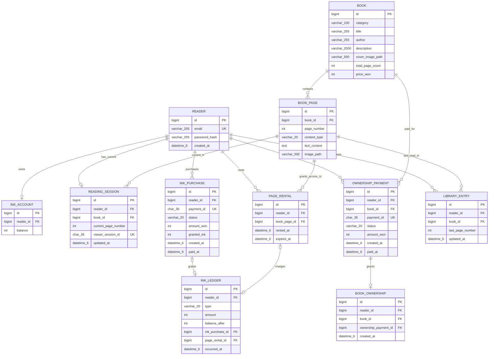
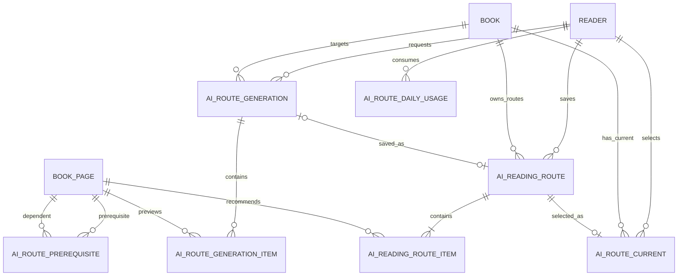

# 읽어볼까 MVP ERD

[PRD 색인](./prd/README.md)으로 돌아갑니다. 이 문서는 합의된 제품 정책을 구현하기 위한 목표 논리 데이터
모델의 정본입니다. 테이블·컬럼·인덱스 변경은 Flyway migration으로 구현합니다.

## 구현 상태

현재 `V1` migration이 아래 잉크·30일 대여·도서 원가 직접 결제 모델의 11개 테이블과 핵심 제약을
생성하고, 11개 JPA Entity와 실제 외래 키 기반 최소 연관관계까지 매핑했습니다. 이 모델을 사용하는 잉크
계좌·원장, 페이지 대여·열람 세션·콘텐츠, 내 서재, 잉크 구매와 소장 결제의 준비·완료·조회 API 및
PortOne 결제 조회·웹훅 멱등 완료 경계까지 구현됐습니다.

[AI 잉크 경로 2차 MVP 목표 모델](#ai-잉크-경로-2차-mvp-목표-모델-구현-전)은 합의된 구현 목표이며 현재
`V1`이나 JPA Entity에 반영되지 않았습니다. 구현할 때 `V1`을 수정하지 않고 새 Flyway migration을 추가합니다.

## 외래 키 관계

Mermaid에서 괄호가 있는 SQL 타입을 안정적으로 표시하기 위해 `varchar_255`, `char_36`, `datetime_6`처럼
표기했습니다. 각각 물리 스키마의 `VARCHAR(255)`, `CHAR(36)`, `DATETIME(6)`을 뜻합니다. 관계선은 실제
외래 키를 나타냅니다. `reading_session` 및 `library_entry`의 `(book_id, current_page_number)`,
`(book_id, last_page_number)`는 각각 `book_page(book_id, page_number)`를 참조하므로 `BOOK_PAGE`와 연결합니다.

`ink_ledger`는 지급 원인인 `ink_purchase`와 차감 원인인 `page_rental` 중 정확히 하나만 참조합니다. 따라서
두 원인 관계의 `|o`는 원장 한 건에서 해당 원인이 없거나 하나임을, `o|`는 하나의 원인이 원장에 연결되지
않았거나 한 번만 연결됨을 뜻합니다.

## 테이블 명세

아래 명세는 현재 `V1` migration의 물리 컬럼을 텍스트로 풀어 쓴 것입니다. `NULL`은 컬럼의 `NULL` 허용
여부이며, 복합 키와 값 사이 제약은 이어지는 [핵심 제약조건](#핵심-제약조건)에서 함께 설명합니다.

### `reader`

| 컬럼 | 물리 타입 | NULL | 키·참조 | 설명 |
| --- | --- | --- | --- | --- |
| `id` | `BIGINT AUTO_INCREMENT` | 아니오 | PK | 독자 식별자 |
| `email` | `VARCHAR(255)` | 아니오 | UK | 정규화해 저장하는 로그인 이메일 |
| `password_hash` | `VARCHAR(255)` | 아니오 | - | 적응형 단방향 함수로 인코딩한 비밀번호 |
| `created_at` | `DATETIME(6)` | 아니오 | - | 계정 생성 시각(UTC) |

### `book`

| 컬럼 | 물리 타입 | NULL | 키·참조 | 설명 |
| --- | --- | --- | --- | --- |
| `id` | `BIGINT AUTO_INCREMENT` | 아니오 | PK, `(id, price_won)` UK 구성 | 도서 식별자 |
| `category` | `VARCHAR(100)` | 아니오 | - | 목록 정렬에 사용하는 카테고리 |
| `title` | `VARCHAR(255)` | 아니오 | - | 도서 제목 |
| `author` | `VARCHAR(255)` | 아니오 | - | 저자명 |
| `description` | `VARCHAR(2000)` | 예 | - | 도서 상세 소개 |
| `cover_image_path` | `VARCHAR(500)` | 예 | - | 공개 표지 자산의 same-origin 경로 |
| `total_page_count` | `INT` | 아니오 | - | 원본 PDF 기준 전체 페이지 수 |
| `price_won` | `INT` | 아니오 | `(id, price_won)` UK 구성 | 온라인 소장에 사용하는 고정 원가(원) |

### `book_page`

| 컬럼 | 물리 타입 | NULL | 키·참조 | 설명 |
| --- | --- | --- | --- | --- |
| `id` | `BIGINT AUTO_INCREMENT` | 아니오 | PK | 변환 페이지 식별자 |
| `book_id` | `BIGINT` | 아니오 | FK → `book.id`, `(book_id, page_number)` UK 구성 | 소속 도서 |
| `page_number` | `INT` | 아니오 | `(book_id, page_number)` UK 구성 | 원본 PDF와 같은 페이지 번호 |
| `content_type` | `VARCHAR(20) CHARACTER SET ascii COLLATE ascii_bin` | 아니오 | - | `TEXT` 또는 `IMAGE` |
| `text_content` | `TEXT` | 예 | - | 텍스트 페이지 본문 |
| `image_path` | `VARCHAR(500)` | 예 | - | 이미지 페이지의 비공개 저장소 경로 |

### `reading_session`

| 컬럼 | 물리 타입 | NULL | 키·참조 | 설명 |
| --- | --- | --- | --- | --- |
| `id` | `BIGINT AUTO_INCREMENT` | 아니오 | PK | 현재 열람 세션 식별자 |
| `reader_id` | `BIGINT` | 아니오 | UK, FK → `reader.id` | 독자당 하나인 현재 열람 세션의 소유자 |
| `book_id` | `BIGINT` | 아니오 | 복합 FK → `book_page(book_id, page_number)` | 현재 도서 |
| `current_page_number` | `INT` | 아니오 | 복합 FK → `book_page(book_id, page_number)` | 현재 원본 PDF 페이지 번호 |
| `viewer_session_id` | `CHAR(36) CHARACTER SET ascii COLLATE ascii_bin` | 아니오 | UK | 서버가 발급한 뷰어 교체 판정용 UUID |
| `updated_at` | `DATETIME(6)` | 아니오 | - | 현재 위치 갱신 시각(UTC) |

### `ink_account`

| 컬럼 | 물리 타입 | NULL | 키·참조 | 설명 |
| --- | --- | --- | --- | --- |
| `id` | `BIGINT AUTO_INCREMENT` | 아니오 | PK | 잉크 계정 식별자 |
| `reader_id` | `BIGINT` | 아니오 | UK, FK → `reader.id` | 잉크 계정 소유자 |
| `balance` | `INT` | 아니오 | - | 현재 사용 가능한 잉크 잔액 |

### `ink_purchase`

| 컬럼 | 물리 타입 | NULL | 키·참조 | 설명 |
| --- | --- | --- | --- | --- |
| `id` | `BIGINT AUTO_INCREMENT` | 아니오 | PK, `(reader_id, id)` UK 구성 | 잉크 구매 시도 식별자 |
| `reader_id` | `BIGINT` | 아니오 | FK → `reader.id`, `(reader_id, id)` UK 구성 | 구매 독자 |
| `payment_id` | `CHAR(36) CHARACTER SET ascii COLLATE ascii_bin` | 아니오 | UK | 서버가 발급한 PortOne 결제 UUID |
| `status` | `VARCHAR(20) CHARACTER SET ascii COLLATE ascii_bin` | 아니오 | - | `PENDING`, `PAID`, `FAILED` 중 하나 |
| `amount_won` | `INT` | 아니오 | - | 결제 준비 금액(원) |
| `granted_ink` | `INT` | 아니오 | - | 검증 성공 시 지급할 잉크 수량 |
| `created_at` | `DATETIME(6)` | 아니오 | - | 결제 시도 생성 시각(UTC) |
| `paid_at` | `DATETIME(6)` | 예 | - | `PAID`가 된 시각(UTC) |

### `page_rental`

| 컬럼 | 물리 타입 | NULL | 키·참조 | 설명 |
| --- | --- | --- | --- | --- |
| `id` | `BIGINT AUTO_INCREMENT` | 아니오 | PK, `(reader_id, id)` UK 구성 | 페이지 대여 기간 식별자 |
| `reader_id` | `BIGINT` | 아니오 | FK → `reader.id`, `(reader_id, id)` UK 구성 | 대여 독자 |
| `book_page_id` | `BIGINT` | 아니오 | FK → `book_page.id` | 대여한 원본 PDF 페이지 |
| `rented_at` | `DATETIME(6)` | 아니오 | - | 1잉크 차감이 완료된 대여 시작 시각(UTC) |
| `expires_at` | `DATETIME(6)` | 아니오 | - | 대여 만료 시각(UTC) |

### `ink_ledger`

| 컬럼 | 물리 타입 | NULL | 키·참조 | 설명 |
| --- | --- | --- | --- | --- |
| `id` | `BIGINT AUTO_INCREMENT` | 아니오 | PK | 변경 불가능한 잉크 내역 식별자 |
| `reader_id` | `BIGINT` | 아니오 | 두 복합 FK 구성 | 지급 또는 차감 원인과 같은 독자 |
| `type` | `VARCHAR(20) CHARACTER SET ascii COLLATE ascii_bin` | 아니오 | - | `GRANT` 또는 `DEDUCTION` |
| `amount` | `INT` | 아니오 | - | 부호 없는 지급·차감 수량 |
| `balance_after` | `INT` | 아니오 | - | 이 내역 반영 직후 잔액 |
| `ink_purchase_id` | `BIGINT` | 예 | UK, 복합 FK → `ink_purchase(reader_id, id)` | `GRANT`의 지급 원인 |
| `page_rental_id` | `BIGINT` | 예 | UK, 복합 FK → `page_rental(reader_id, id)` | `DEDUCTION`의 차감 원인 |
| `occurred_at` | `DATETIME(6)` | 아니오 | - | 잉크 변경 발생 시각(UTC) |

### `ownership_payment`

| 컬럼 | 물리 타입 | NULL | 키·참조 | 설명 |
| --- | --- | --- | --- | --- |
| `id` | `BIGINT AUTO_INCREMENT` | 아니오 | PK, `(reader_id, book_id, id)` UK 구성 | 소장 결제 시도 식별자 |
| `reader_id` | `BIGINT` | 아니오 | FK → `reader.id`, 복합 UK 구성 | 결제 독자 |
| `book_id` | `BIGINT` | 아니오 | 복합 FK → `book(id, price_won)`, 복합 UK 구성 | 소장 대상 도서 |
| `payment_id` | `CHAR(36) CHARACTER SET ascii COLLATE ascii_bin` | 아니오 | UK | 서버가 발급한 PortOne 결제 UUID |
| `status` | `VARCHAR(20) CHARACTER SET ascii COLLATE ascii_bin` | 아니오 | - | `PENDING`, `PAID`, `FAILED` 중 하나 |
| `amount_won` | `INT` | 아니오 | 복합 FK → `book(id, price_won)` | 준비 시 저장한 도서 원가(원) |
| `created_at` | `DATETIME(6)` | 아니오 | - | 결제 시도 생성 시각(UTC) |
| `paid_at` | `DATETIME(6)` | 예 | - | `PAID`가 된 시각(UTC) |

### `book_ownership`

| 컬럼 | 물리 타입 | NULL | 키·참조 | 설명 |
| --- | --- | --- | --- | --- |
| `id` | `BIGINT AUTO_INCREMENT` | 아니오 | PK | 기간 없는 온라인 소장 권한 식별자 |
| `reader_id` | `BIGINT` | 아니오 | `(reader_id, book_id)` UK, 복합 FK 구성 | 소장 독자 |
| `book_id` | `BIGINT` | 아니오 | `(reader_id, book_id)` UK, 복합 FK 구성 | 소장 도서 |
| `ownership_payment_id` | `BIGINT` | 아니오 | UK, 복합 FK → `ownership_payment(reader_id, book_id, id)` | 권한을 부여한 결제 |
| `created_at` | `DATETIME(6)` | 아니오 | - | 소장 권한 생성 시각(UTC) |

### `library_entry`

| 컬럼 | 물리 타입 | NULL | 키·참조 | 설명 |
| --- | --- | --- | --- | --- |
| `id` | `BIGINT AUTO_INCREMENT` | 아니오 | PK | 내 서재 항목 식별자 |
| `reader_id` | `BIGINT` | 아니오 | FK → `reader.id`, `(reader_id, book_id)` UK 구성 | 서재 소유자 |
| `book_id` | `BIGINT` | 아니오 | 복합 FK → `book_page(book_id, page_number)`, 복합 UK 구성 | 서재 도서 |
| `last_page_number` | `INT` | 아니오 | 복합 FK → `book_page(book_id, page_number)` | 마지막으로 성공한 원본 PDF 페이지 번호 |
| `updated_at` | `DATETIME(6)` | 아니오 | - | 마지막 위치 갱신 시각(UTC) |

## 핵심 제약조건

| 대상 | 제약 |
| --- | --- |
| `reader` | 정규화한 `email` 고유 |
| `book` | `(id, price_won)` 고유, `total_page_count > 0`, `price_won > 0`, 비어 있지 않은 `category` |
| `book_page` | `(book_id, page_number)` 고유, `page_number > 0`, `TEXT`·`IMAGE` 중 정확히 한 콘텐츠 형식 |
| `reading_session` | `reader_id`·`viewer_session_id` 각각 고유, `current_page_number > 0`, `(book_id, current_page_number)`로 실제 `book_page` 참조 |
| `ink_account` | `reader_id` 고유, `balance >= 0` |
| `ink_purchase` | `payment_id` 고유, `PENDING`·`PAID`·`FAILED`, `PAID`만 `paid_at` 필수, 1,000원·100잉크 조합만 허용 |
| `ink_ledger` | `ink_purchase_id`·`page_rental_id` 각각 고유, 지급 100잉크 또는 대여 차감 1잉크와 원인 하나만 연결, `balance_after >= 0`, 원인과 같은 `reader_id` 보장 |
| `page_rental` | `rented_at < expires_at`, 과거 대여를 보존하므로 같은 페이지의 여러 기간 허용 |
| `ownership_payment` | `payment_id` 고유, `PENDING`·`PAID`·`FAILED`, `PAID`만 `paid_at` 필수, `(book_id, amount_won)`으로 도서 원가 일치 |
| `book_ownership` | `(reader_id, book_id)`·`ownership_payment_id` 각각 고유, 결제의 독자·도서와 소장의 독자·도서 일치 |
| `library_entry` | `(reader_id, book_id)` 고유, `last_page_number > 0`, `(book_id, last_page_number)`로 실제 `book_page` 참조 |

물리 외래 키의 삭제·수정 동작은 기본값인 `RESTRICT`이며 핵심 이력을 연쇄 삭제하지 않습니다.
모든 시각 컬럼은 UTC로 읽고 쓰는 `DATETIME(6)`입니다. `viewer_session_id`와 두 결제 테이블의
`payment_id`는 대소문자가 별개인 ASCII 값으로 비교합니다.

## 애플리케이션이 보장하는 불변식

물리 제약만으로 표현할 수 없거나 역사 테이블을 유지하려면 트랜잭션 판정이 필요한 규칙은
애플리케이션이 다음과 같이 보장합니다.

- 이메일은 정규화한 뒤 저장하고, `viewerSessionId`와 `paymentId`는 서버가 UUID로 발급합니다.
  `paymentId`는 두 결제 테이블 전체에서 고유하게 사용합니다.
- 회원가입은 `Reader`와 0잉크 `InkAccount`를 하나의 트랜잭션에서 함께 만듭니다.
- `Book.totalPageCount`는 원본 PDF 페이지 수와 같고 `BookPage.pageNumber`는 1부터
  `totalPageCount`까지 빈번호 없이 한 번씩 존재해야 합니다.
- `PageRental.expiresAt`은 `rentedAt`에서 제품 정책의 대여 기간을 더한 값입니다. 활성 대여 중복
  차감은 `InkAccount`를 잠근 뒤 소장·대여를 다시 조회해 방지합니다.
- 새 대여의 잔액 차감, `InkLedger`, `PageRental`, `LibraryEntry`는 하나의 트랜잭션에서
  함께 성공하거나 함께 실패합니다. 원장과 대여·결제 이력은 수정·삭제하지 않습니다.
- 소장 결제 준비는 `InkAccount`를 잠그고 이미 소장했는지와 같은 독자·도서의 `PENDING`을
  확인합니다. 기존 `PENDING`은 재사용하고 `FAILED`만 있을 때 새 시도를 만듭니다.
- 오직 서버 검증을 통과한 `PAID` 결제만 같은 트랜잭션에서 `InkLedger` 지급 또는
  `BookOwnership`을 하나 만듭니다. DB 외래 키는 결제 상태가 `PAID`인지까지 판정하지 않습니다.
- 소장이 먼저 완료되면 새 대여를 만들지 않고, 대여가 먼저 완료되면 해당 1잉크를 환급하지
  않습니다. 소장으로 처음 서재에 추가하는 도서에 열람 위치가 없으면 `lastPageNumber=1`로
  시작하고, 이후 성공한 페이지 열기만 마지막 위치를 변경합니다.

모든 테이블의 기본 collation은 MySQL 8의 `utf8mb4_0900_ai_ci`입니다. 따라서 도서 제목·저자 검색은
영문 대소문자를 구분하지 않으며, `%`와 `_`의 리터럴 처리는 조회 쿼리에서 별도로 이스케이프합니다.

## 콘텐츠 저장 규칙

- `Book.totalPageCount`와 해당 도서의 `BookPage` 수는 원본 PDF 페이지 수와 같아야 합니다.
- `BookPage.contentType`은 `TEXT` 또는 `IMAGE`입니다.
- `TEXT`는 `textContent`, `IMAGE`는 비공개 저장소의 `imagePath`만 사용합니다.
- 원본 PDF와 내부 저장소 주소는 공개 API에 포함하지 않습니다.

## AI 잉크 경로 2차 MVP 목표 모델 (구현 전)

이 절은 [AI 잉크 경로 PRD](./prd/ai-ink-route.md)와
[목표 API 계약](./api-spec.md#ai-잉크-경로-2차-mvp-목표-계약-구현-전)을 구현하기 위한 논리·물리 목표입니다.
아래 컬럼과 테이블은 아직 존재하지 않으며 구현 완료 뒤에만 위 구현 상태와 현재 외래 키 관계에 합칩니다.

### 목표 관계

### 기존 테이블 확장

#### `book` 추가 컬럼

| 컬럼 | 물리 타입 | NULL | 설명 |
| --- | --- | --- | --- |
| `content_version` | `VARCHAR(100) CHARACTER SET ascii COLLATE ascii_bin` | 아니오 | 현재 적재한 콘텐츠 manifest의 버전 |
| `ai_route_supported` | `BOOLEAN` | 아니오 | 현재 버전을 공개 AI 경로 생성에 사용할 수 있는지 여부 |
| `ai_external_transfer_allowed` | `BOOLEAN` | 아니오 | 외부 AI 전송 권리 확인 여부 |
| `ai_data_policy_version` | `VARCHAR(100) CHARACTER SET ascii COLLATE ascii_bin` | 예 | 콘텐츠 manifest에서 복사한 지원 데이터 정책 프로필 ID |

`ai_route_supported=true`인 도서는 외부 전송이 허용되고
[지원 데이터 정책 프로필](./evidence/openai-data-policy/README.md)이 있어야 하며, 활성화한 서버의
`OPENAI_DATA_POLICY_VERSION`과 같아야 합니다. 소설과 품질 평가 전 콘텐츠는 `false`입니다. 콘텐츠 버전은
페이지·임베딩·선수 관계를 함께 적재할 때만 바꿉니다.

#### `book_page` 추가 컬럼

| 컬럼 | 물리 타입 | NULL | 설명 |
| --- | --- | --- | --- |
| `ai_analysis_text` | `MEDIUMTEXT` | 예 | 외부 후보 분석에만 쓰는 비공개 텍스트 |
| `ai_public_guide_topic` | `VARCHAR(500)` | 예 | 사람 검수를 통과한 공개 가이드 주제 |
| `estimated_reading_seconds` | `INT` | 예 | 예상 독서 시간 계산 입력값 |
| `embedding_model` | `VARCHAR(100) CHARACTER SET ascii COLLATE ascii_bin` | 예 | 페이지 임베딩 모델 |
| `embedding_dimensions` | `INT` | 예 | 페이지 임베딩 차원 |
| `embedding_json` | `JSON` | 예 | 고정 차원의 실수 배열 |
| `duplicate_group_keys` | `JSON` | 예 | 의미상 중복 그룹 키 문자열 배열, 고유 페이지는 빈 배열 |
| `ai_route_candidate` | `TINYINT(1)` | 아니오 | 이 페이지를 AI 경로 후보로 쓰는가, 기본값 `0` |

`ai_route_candidate`는 `NOT NULL`이며 기본값 `0`입니다. AI 경로 지원 도서에서 실제로 후보로 쓰는
페이지만 `1`이고, 목차처럼 본문 설명이 없는 구조 페이지와 미지원 도서의 모든 페이지는 `0`입니다.
후보 검색은 이 값이 `1`인 페이지만 대상으로 삼은 뒤 그 안에서 벡터 유효성을 검증합니다. 벡터가
있는 페이지만 고르는 방식으로 대신하지 않습니다.

`ai_route_candidate=1`인 페이지는 위 일곱 필드를 모두 가져야 하고 `estimated_reading_seconds`와
`embedding_dimensions`는 0보다 커야 합니다. `ai_route_candidate=0`인 페이지는 임베딩 세 필드를
`NULL`로 두고, 미지원 도서는 일곱 필드를 모두 `NULL`로 둘 수 있습니다.
분석 텍스트·임베딩·중복 그룹은 공개 API에 반환하지 않습니다.
generation·저장 route 항목이 페이지의 도서를 복합 FK로 확인할 수 있도록
`(id, book_id)` 고유키를 추가합니다.

### 새 테이블

#### `ai_route_prerequisite`

| 컬럼 | 물리 타입 | NULL | 키·참조 | 설명 |
| --- | --- | --- | --- | --- |
| `id` | `BIGINT AUTO_INCREMENT` | 아니오 | PK | 선수 관계 식별자 |
| `book_id` | `BIGINT` | 아니오 | 두 복합 FK와 UK 구성 | 같은 도서 강제 |
| `prerequisite_page_number` | `INT` | 아니오 | 복합 FK → `book_page(book_id, page_number)`, UK 구성 | 먼저 읽을 페이지 |
| `dependent_page_number` | `INT` | 아니오 | 복합 FK → `book_page(book_id, page_number)`, UK 구성 | 선수 페이지에 의존하는 페이지 |

`(book_id, prerequisite_page_number, dependent_page_number)`는 고유하고 두 페이지 번호는 달라야 합니다.
방향 순환과 콘텐츠 버전 전체의 위상 정렬 가능 여부는 적재 전에 애플리케이션이 검증합니다.

#### `ai_route_generation`

| 컬럼 | 물리 타입 | NULL | 키·참조 | 설명 |
| --- | --- | --- | --- | --- |
| `generation_id` | `CHAR(36) CHARACTER SET ascii COLLATE ascii_bin` | 아니오 | PK, `(generation_id, book_id)` UK·`(saved_route_id, generation_id)` FK 구성 | 서버 발급 임시 결과 UUID |
| `reader_id` | `BIGINT` | 아니오 | FK → `reader.id`, `(reader_id, idempotency_key)` UK 구성 | 요청 소유자 |
| `book_id` | `BIGINT` | 아니오 | FK → `book.id`, `(generation_id, book_id)` UK 구성 | 대상 도서 |
| `content_version` | `VARCHAR(100) CHARACTER SET ascii COLLATE ascii_bin` | 아니오 | - | 생성 시점 콘텐츠 버전 스냅샷 |
| `idempotency_key` | `CHAR(36) CHARACTER SET ascii COLLATE ascii_bin` | 아니오 | `(reader_id, idempotency_key)` UK 구성 | 클라이언트 생성 UUID |
| `request_fingerprint` | `CHAR(64) CHARACTER SET ascii COLLATE ascii_bin` | 아니오 | - | 정규화한 전체 생성 입력의 SHA-256 |
| `normalized_purpose` | `VARCHAR(200)` | 예 | - | 저장 전까지 보관하는 정규화한 독서 목적 |
| `request_type` | `VARCHAR(20) CHARACTER SET ascii COLLATE ascii_bin` | 예 | - | `INK_BUDGET` 또는 `OWNED_DEPTH` |
| `max_additional_ink` | `INT` | 예 | - | 비소장 예산 |
| `depth` | `VARCHAR(20) CHARACTER SET ascii COLLATE ascii_bin` | 예 | - | `QUICK`, `BALANCED`, `DEEP` 중 하나 |
| `status` | `VARCHAR(20) CHARACTER SET ascii COLLATE ascii_bin` | 아니오 | - | `GENERATING`, `ROUTE`, `NO_ROUTE`, `FAILED`, `SAVED`, `CONSUMED` 중 하나 |
| `no_route_reason` | `VARCHAR(40) CHARACTER SET ascii COLLATE ascii_bin` | 예 | - | `NO_RELEVANT_PAGES` 또는 `INSUFFICIENT_BUDGET` |
| `minimum_required_ink` | `INT` | 예 | - | 예산 부족 `NO_ROUTE`의 최소 추가 잉크 |
| `failure_code` | `VARCHAR(100) CHARACTER SET ascii COLLATE ascii_bin` | 예 | - | `FAILED` 재조회에 사용할 공개 오류 코드 |
| `saved_route_id` | `BIGINT` | 예 | UK, 복합 FK → `ai_reading_route(id, generation_id)` 구성 | `SAVED`가 반환할 저장 경로 |
| `created_at` | `DATETIME(6)` | 아니오 | - | 생성 시작 시각(UTC) |
| `completed_at` | `DATETIME(6)` | 예 | - | 첫 최종 상태 확정 시각(UTC) |
| `expires_at` | `DATETIME(6)` | 예 | - | 최종 상태 확정 뒤 계산한 임시 상태·결과 만료 시각(UTC) |

저장 전 상태는 `normalized_purpose`, `request_type`과 그에 맞는 `max_additional_ink` 또는 `depth` 중 하나를
가집니다. `ROUTE`만 결과 항목을 가집니다. `NO_ROUTE`는 `no_route_reason`을 반드시 가지며
`NO_RELEVANT_PAGES`이면 `minimum_required_ink`가 `NULL`, `INSUFFICIENT_BUDGET`이면 선택 예산보다 큰 최소
추가 잉크를 가집니다. 다른 상태에서는 두 필드가 모두 `NULL`입니다.
`FAILED`는 임시 경로 없이 멱등 오류만 재현합니다. 저장 성공 시 임시 항목과 목적·입력 필드를 제거하고
`SAVED`·`saved_route_id`·`request_fingerprint`만 원래 만료 시각까지 보존합니다. `saved_route_id`와
`generation_id` 복합 FK는 포인터가 같은 임시 생성을 소비한 저장 경로만 가리키게 합니다. 저장 경로가 먼저
삭제되면 `CONSUMED`로 바꾸고 포인터를 비웁니다. `GENERATING`만 `completed_at`·`expires_at`이 없고 최종
상태는 두 시각을 모두 가집니다. 중단된 `GENERATING`은 전체 시간 제한 뒤 `FAILED`로 복구해 같은 키가 외부
호출을 다시 시작하지 않게 합니다. 만료 정리는 남은 항목을 먼저 지운 뒤 생성 행을 삭제합니다.

#### `ai_route_generation_item`

| 컬럼 | 물리 타입 | NULL | 키·참조 | 설명 |
| --- | --- | --- | --- | --- |
| `id` | `BIGINT AUTO_INCREMENT` | 아니오 | PK | 임시 경로 항목 식별자 |
| `generation_id` | `CHAR(36) CHARACTER SET ascii COLLATE ascii_bin` | 아니오 | 복합 FK → `ai_route_generation(generation_id, book_id)`, UK 구성 | 소속 임시 결과 |
| `book_id` | `BIGINT` | 아니오 | generation·페이지 복합 FK 구성 | 상위 생성과 추천 페이지의 같은 도서 강제 |
| `book_page_id` | `BIGINT` | 아니오 | 복합 FK → `book_page(id, book_id)`, UK 구성 | 추천 페이지 |
| `position` | `INT` | 아니오 | `(generation_id, position)` UK 구성 | 1부터 시작하는 경로 순서 |
| `relevance` | `VARCHAR(20) CHARACTER SET ascii COLLATE ascii_bin` | 아니오 | - | `HIGH` 또는 `MEDIUM` |
| `prerequisite` | `BOOLEAN` | 아니오 | - | 선수 개념 페이지 여부 |
| `role` | `VARCHAR(20) CHARACTER SET ascii COLLATE ascii_bin` | 아니오 | - | API 계약의 경로 역할 |

같은 생성 결과에서 `position`과 `book_page_id`는 각각 고유합니다. 페이지의 도서 일치는 복합 FK로
강제하고, `book_page`에 콘텐츠 버전 컬럼이 없으므로 생성 행과의 콘텐츠 버전 일치는 애플리케이션 계층에서
검증합니다.

#### `ai_reading_route`

| 컬럼 | 물리 타입 | NULL | 키·참조 | 설명 |
| --- | --- | --- | --- | --- |
| `id` | `BIGINT AUTO_INCREMENT` | 아니오 | PK, `(id, book_id)`·`(id, generation_id)`·`(reader_id, book_id, id)` 복합 UK 구성 | 저장 경로 식별자 |
| `generation_id` | `CHAR(36) CHARACTER SET ascii COLLATE ascii_bin` | 아니오 | UK, `(id, generation_id)` UK·복합 FK 대상 구성 | 소비한 임시 생성 식별자 |
| `reader_id` | `BIGINT` | 아니오 | FK → `reader.id`, `(reader_id, book_id, id)` UK 구성 | 경로 소유자 |
| `book_id` | `BIGINT` | 아니오 | FK → `book.id`, `(id, book_id)`·`(reader_id, book_id, id)` UK 구성 | 대상 도서 |
| `content_version` | `VARCHAR(100) CHARACTER SET ascii COLLATE ascii_bin` | 아니오 | - | 저장한 경로의 콘텐츠 버전 |
| `normalized_purpose` | `VARCHAR(200)` | 아니오 | - | 저장한 독서 목적 |
| `request_type` | `VARCHAR(20) CHARACTER SET ascii COLLATE ascii_bin` | 아니오 | - | `INK_BUDGET` 또는 `OWNED_DEPTH` |
| `max_additional_ink` | `INT` | 예 | - | 생성 때 사용한 비소장 예산 |
| `depth` | `VARCHAR(20) CHARACTER SET ascii COLLATE ascii_bin` | 예 | - | 생성 때 사용한 소장 깊이 |
| `completed_at` | `DATETIME(6)` | 예 | - | 모든 항목을 처음 연 시각(UTC) |
| `feedback` | `VARCHAR(20) CHARACTER SET ascii COLLATE ascii_bin` | 예 | - | `HELPFUL`, `NEUTRAL`, `NOT_HELPFUL` 중 하나 |
| `feedback_at` | `DATETIME(6)` | 예 | - | 피드백 생성·변경 시각(UTC) |
| `created_at` | `DATETIME(6)` | 아니오 | - | 저장 시각(UTC) |

`generation_id` 고유 제약으로 같은 임시 결과의 저장 재시도를 기존 경로에 연결합니다. generation에서
route를 향하는 복합 FK이므로 임시 generation을 만료 삭제한 뒤에도 저장 route의 식별자는 보존됩니다. 입력
조합은 생성 행과 같은 배타 규칙을 따르며 피드백은 `completed_at`이 있는 경로에만 저장합니다.

#### `ai_reading_route_item`

| 컬럼 | 물리 타입 | NULL | 키·참조 | 설명 |
| --- | --- | --- | --- | --- |
| `id` | `BIGINT AUTO_INCREMENT` | 아니오 | PK | 저장 경로 항목 식별자 |
| `route_id` | `BIGINT` | 아니오 | 복합 FK → `ai_reading_route(id, book_id)`, UK 구성 | 소속 저장 경로 |
| `book_id` | `BIGINT` | 아니오 | route·페이지 복합 FK 구성 | 상위 경로와 추천 페이지의 같은 도서 강제 |
| `book_page_id` | `BIGINT` | 아니오 | 복합 FK → `book_page(id, book_id)`, UK 구성 | 추천 페이지 |
| `position` | `INT` | 아니오 | `(route_id, position)` UK 구성 | 고정 추천 순서 |
| `relevance` | `VARCHAR(20) CHARACTER SET ascii COLLATE ascii_bin` | 아니오 | - | 저장한 정성 관련도 |
| `prerequisite` | `BOOLEAN` | 아니오 | - | 저장한 선수 개념 여부 |
| `role` | `VARCHAR(20) CHARACTER SET ascii COLLATE ascii_bin` | 아니오 | - | 저장한 경로 역할 |
| `opened_at` | `DATETIME(6)` | 예 | - | 경로 페이지 콘텐츠를 처음 제공한 시각(UTC) |

같은 경로에서 `position`과 `book_page_id`는 각각 고유합니다. 페이지의 도서 일치는 복합 FK로 강제하고,
`book_page`에 콘텐츠 버전 컬럼이 없으므로 경로와의 콘텐츠 버전 일치는 애플리케이션 계층에서 검증합니다.
저장 뒤 항목과 순서는 수정하지 않고 `opened_at`만 최초 콘텐츠 제공에 성공할 때 기록합니다.

#### `ai_route_current`

| 컬럼 | 물리 타입 | NULL | 키·참조 | 설명 |
| --- | --- | --- | --- | --- |
| `reader_id` | `BIGINT` | 아니오 | PK 구성, 복합 FK 구성 | 경로 소유자 |
| `book_id` | `BIGINT` | 아니오 | PK 구성, 복합 FK 구성 | 대상 도서 |
| `route_id` | `BIGINT` | 아니오 | UK, 복합 FK → `ai_reading_route(reader_id, book_id, id)` | 현재 경로 |
| `updated_at` | `DATETIME(6)` | 아니오 | - | 현재 경로 변경 시각(UTC) |

`(reader_id, book_id)` 기본 키로 책마다 현재 경로를 최대 하나만 둡니다. 저장·현재 지정·현재 경로 삭제는 이
기본 키를 원자적으로 upsert하거나 잠그고 같은 독자·도서의 저장 경로와 한 트랜잭션으로 처리합니다.

#### `ai_route_daily_usage`

| 컬럼 | 물리 타입 | NULL | 키·참조 | 설명 |
| --- | --- | --- | --- | --- |
| `reader_id` | `BIGINT` | 아니오 | PK 구성, FK → `reader.id` | 생성 요청 독자 |
| `usage_date` | `DATE` | 아니오 | PK 구성 | UTC 기준 사용 날짜 |
| `generation_count` | `INT` | 아니오 | - | 외부 호출을 시작한 새 요청 수 |

`(reader_id, usage_date)` 기본 키와 원자적 조건부 증가로 PRD의 계정별 한도를 넘지 않게 하며
`generation_count >= 0`을 보장합니다. 과거 날짜 행은 결제·잉크 원장이 아니므로 운영 보존 기간을 정한 뒤
정리할 수 있습니다.

### 목표 트랜잭션과 삭제 경계

- 생성 시작은 `ai_route_generation` 멱등 행 생성과 `ai_route_daily_usage` 증가를 한 트랜잭션으로 처리한 뒤
  외부 API를 호출합니다. 외부 호출은 DB 트랜잭션 안에서 수행하지 않습니다.
- 임시 저장은 생성 결과·소유자·도서·콘텐츠 버전·만료를 다시 검증하고 저장 경로·항목·현재 경로를 한
  트랜잭션으로 만듭니다. 성공 뒤 임시 항목과 목적·입력을 제거하고 생성 행은 `SAVED`와 저장 경로 포인터만
  원래 만료 시각까지 보존합니다. 저장 경로의 `generation_id`는 기한 없이 보존합니다.
- 저장 경로 삭제는 현재 포인터, 경로 항목, 경로 순서로 명시적으로 삭제하고 `PageRental`과 `InkLedger`는
  건드리지 않습니다. 아직 남은 생성 멱등 행은 `CONSUMED`로 바꾸며, 현재 경로였다면 같은 트랜잭션에서
  PRD가 정한 후속 경로를 지정합니다.
- 다른 독자의 임시·저장 경로는 소유자 조건을 포함한 조회에서 찾지 못한 것으로 처리합니다.

## 요구사항 추적

| 엔티티 | 요구사항 |
| --- | --- |
| `Reader`, `ReadingSession` | `AUTH-*`, `VIEW-002` |
| `Book`, `BookPage` | `CAT-*`, `VIEW-001`, `VIEW-003~005` |
| `InkAccount`, `InkPurchase`, `InkLedger` | `INK-*`, `PAY-*` |
| `PageRental` | `RENT-*` |
| `OwnershipPayment`, `BookOwnership` | `OWN-*`, `PAY-*` |
| `LibraryEntry` | `LIB-001` |
| `Book`·`BookPage` AI 확장, `AiRoutePrerequisite` | `AIR-004`, `AIR-006`, `AIR-013~015` |
| `AiRouteGeneration`, `AiRouteGenerationItem`, `AiRouteDailyUsage` | `AIR-001~007`, `AIR-011~013`, `AIR-016~017` |
| `AiReadingRoute`, `AiReadingRouteItem`, `AiRouteCurrent` | `AIR-007~010`, `AIR-016` |

현행 데이터 구조를 선택한 배경은 [ADR 색인](./adr/README.md)에서 확인합니다. 최초 기준선 전에 폐기한
초안과 물리 모델은 Git 이력에서 확인합니다.
